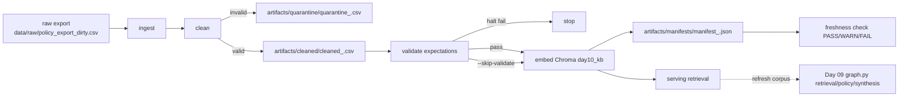

# Kiến trúc pipeline — Lab Day 10

**Nhóm:** C401-E5  
**Cập nhật:** 15/04/2026

---

## 1. Sơ đồ luồng (bắt buộc có 1 diagram: Mermaid / ASCII)



```text
[raw export: data/raw/policy_export_dirty.csv]
                    |
                    v
                [ingest]
                    |
                    v
                 [clean]
        invalid /     \ valid
               v       v
 [quarantine_<run_id>.csv]   [cleaned_<run_id>.csv]
                                   |
                                   v
                      [validate expectations]
                       / halt fail      \ pass or --skip-validate
                      v                  v
                  [stop]      [embed Chroma: day10_kb]
                                       |
                                       v
                           [manifest_<run_id>.json]
                                       |
                                       v
                          [freshness PASS/WARN/FAIL]
                                       |
                                       v
                             [serving retrieval]
                                       |
                                       v
                   [Day 09 retrieval/policy/synthesis]
```

> Điểm đo **freshness**: đọc `latest_exported_at` từ manifest và so với SLA giờ trong `FRESHNESS_SLA_HOURS`.  
> Chỗ ghi **run_id**: tên file log/cleaned/quarantine/manifest đều có hậu tố `<run_id>`.  
> File **quarantine**: `artifacts/quarantine/quarantine_<run_id>.csv`.

Theo run gần nhất `ci-smoke2`, nhóm ghi nhận: `raw_records=10`, `cleaned_records=6`, `quarantine_records=4`.  
Kết quả freshness trên manifest này: `FAIL` vì `age_hours=120.548` lớn hơn `sla_hours=24.0` (bộ dữ liệu mẫu tĩnh, không phải lỗi pipeline logic).

---

## 2. Ranh giới trách nhiệm

| Thành phần | Input | Output | Owner nhóm |
|------------|-------|--------|--------------|
| Ingest | `data/raw/policy_export_dirty.csv` hoặc raw export mở rộng | Bản ghi thô + log `run_id`, `raw_records` | Ingestion Owner |
| Transform | Bản ghi thô từ ingest | Cleaned dataset + quarantine theo reason | Cleaning/Quality Owner |
| Quality | Cleaned dataset | Kết quả expectation `warn/halt`, tín hiệu dừng/chạy tiếp | Cleaning/Quality Owner |
| Embed | `artifacts/cleaned/cleaned_<run_id>.csv` | Upsert + prune vào Chroma `day10_kb` | Embed Owner |
| Monitor | `artifacts/manifests/manifest_<run_id>.json` | Freshness PASS/WARN/FAIL + chi tiết SLA | Monitoring/Docs Owner |

Luồng bàn giao nhóm áp dụng: Ingest -> Transform -> Quality gate -> Embed -> Monitor.  
Khi expectation `halt` fail, pipeline dừng trước embed để tránh publish dữ liệu lỗi vào serving layer.

---

## 3. Idempotency & rerun

> Mô tả: upsert theo `chunk_id` hay strategy khác? Rerun 2 lần có duplicate vector không?

Nhóm đang dùng **upsert theo `chunk_id`** và **prune id dư** sau mỗi lần publish.

Ý nghĩa vận hành:
- Rerun cùng dữ liệu không tạo duplicate vector.
- Index luôn phản ánh snapshot cleaned mới nhất.
- Giảm nguy cơ top-k còn dính chunk stale của run trước.

Bằng chứng từ 2 run liên tiếp (`ci-smoke`, `ci-smoke2`): cùng `raw_records=10`, `cleaned_records=6`, `quarantine_records=4`, cho thấy transform ổn định trên cùng input.

Kết luận: với chiến lược hiện tại, rerun 2 lần **không tạo duplicate vector về mặt thiết kế**, và hành vi pipeline nhất quán theo manifest.

---

## 4. Liên hệ Day 09

> Pipeline này cung cấp / làm mới corpus cho retrieval trong `day09/lab` như thế nào? (cùng `data/docs/` hay export riêng?)

Day 10 đóng vai trò “data gate” trước serving; Day 09 là lớp orchestration trả lời.

Trạng thái hiện tại của code:
- Day 09 retrieval đang đọc `day09_docs`.
- Day 10 pipeline đang publish vào `day10_kb`.

Vì vậy, nhóm giữ 2 collection riêng để test độc lập (A/B giữa orchestration và data quality).  
Khi cần chạy end-to-end cho demo cuối, nhóm sẽ đồng bộ tên collection qua env để Day 09 đọc trực tiếp index Day 10 vừa publish.

Nguyên tắc tích hợp nhóm thống nhất:
- Chỉ cho Day 09 đọc collection đã pass expectation `halt`.
- Bắt buộc giữ metadata `doc_id`, `effective_date`, `run_id` để truy vết answer.
- Mọi thay đổi contract dữ liệu phải đi cùng cập nhật cleaning rules.

---

## 5. Rủi ro đã biết

- Mismatch collection giữa Day 09 và Day 10 làm agent vẫn đọc corpus cũ. Giảm thiểu: checklist deploy bắt buộc xác nhận collection serving.
- Dùng `--skip-validate` sai mục đích có thể publish dữ liệu lỗi vào index. Giảm thiểu: chỉ dùng cho inject demo và phải ghi rõ `run_id` trong report.
- Freshness có thể FAIL nếu `latest_exported_at` cũ dù pipeline vừa chạy (đã quan sát ở `ci-smoke2`). Giảm thiểu: định nghĩa rõ SLA theo boundary và cập nhật timestamp nguồn đúng chu kỳ.
- Thêm `doc_id` mới nhưng quên cập nhật allowlist/contract sẽ bị quarantine ngoài ý muốn. Giảm thiểu: review code + contract trong cùng PR.
- `chunk_id` hiện còn phụ thuộc `seq`, khi thứ tự export đổi mạnh có thể gây churn id. Giảm thiểu: cân nhắc natural key/version key từ nguồn ở vòng cải tiến tiếp theo.
